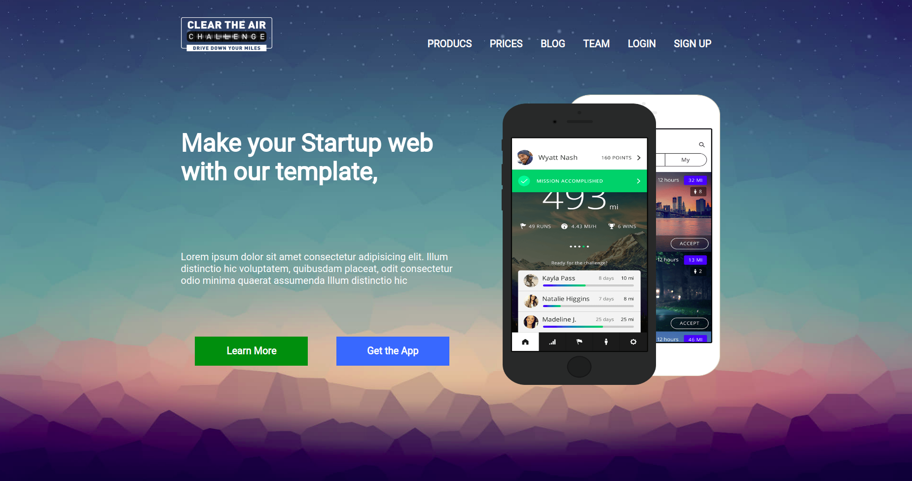

## SignIn Basic Responsive Design Homepage

#### DCI  Assignment 

##### Practicing CSS and Media Queries for  displaying the page on different devices with different screen size.

### Expected Result

### My Output so far 

### Resources

- [Position- CSS TRICKS](https://css-tricks.com/absolute-relative-fixed-positioining-how-do-they-differ/)
- [Position- MDN](https://developer.mozilla.org/en-US/docs/Web/CSS/position)
- [Media Queries for Standard Devices- CSS TRICKS](https://css-tricks.com/snippets/css/media-queries-for-standard-devices/)
- [Using media queries-MDN](https://developer.mozilla.org/en-US/docs/Web/CSS/Media_Queries/Using_media_queries)
